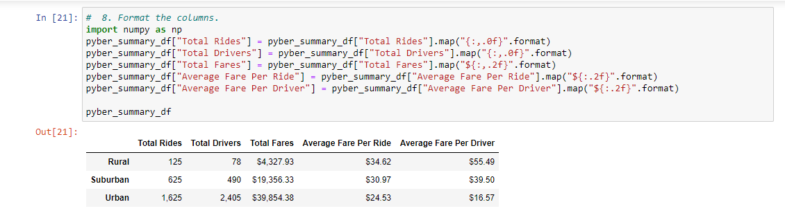
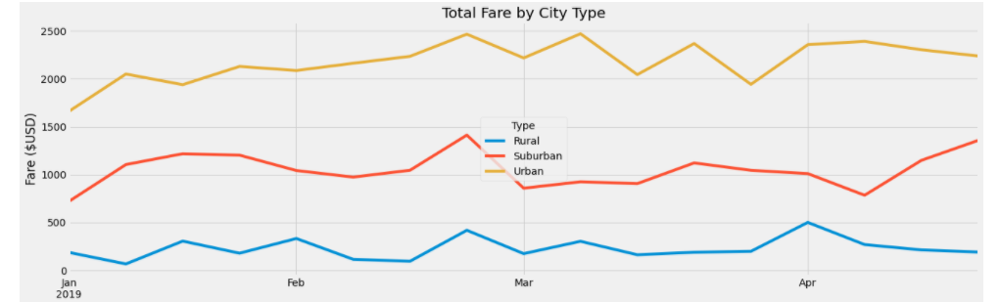

# PyBer_Analysis
To analyze data of a ride sharing application

### Overview of the Ride-Sharing Analysis

The purpose of this analysis is to provide a high-level insight (analysis & visualization) on PyBer's ride-sharing data (Jan-May 2019) from 3 city types with the ultimate aim of aiding the CEO of PyBer to make informed changes / decisions that will optimize PyBer's ride sharing business in these 3 city types. The analysis invoved;

  1. Creating a dataframe of ride-sharing data for the 3 city types
  2. Creating a multi-line graph that shows the total weekly fares for each city types

To generate these analysis, I utilized the following resources;

  - Data Source: city_data.csv, ride_data.csv
  - Softwares: Anaconda 4.8.3, Jupyter Notebook, Python 3.7.6 - Pandas & Matplotlib
  
### Results
  
Following the analysis of PyBer's ride-sharing data, the following are some of the observable differences / insights that I found from the different city types;  

- _Total Drivers for Each City Type:_ In the period under review, the urban cities had the highest total number of drivers (2,405) followed by suburban cities (490) while the rural cities had the least numbers with 78 drivers. This data shows that about 80.9% of the drivers are situated in the urban cities, whilst suburban and rural cities have 16.5% and 2.6% respectively.

- _Total Number of Rides:_ Of the 3 city types, urban cities account for the highest number of rides with 1,625 (68.4%) followed by suburban cities with 625 (26.3%) and lastly by rural cities with 125 rides (5.3%). This data is consistent with our expectation as urban city type, with the hghest number of drivers, is expected to have the highest number of total rides.

- _Total Amount of Fares:_ Urban city type generated the highest total amount of fares with $39,854 (62.7%) followed by suburban city type with $19,356 (30.5%) and lastly by rural city type with $4,328 (6.8%). Again, this result is consistent with our exepectation as urban city type and suburban city type have the largest number of drivers and rides.  

- _Average Fare Per Ride:_ A review of this data shows that rural city type generated the highest average fare of $34.62 followed by suburban with an average of $30.97 whilst urban city generated the lowest avaerage fare of $24.53. These figures indicate a 41.1% difference between average fares in rural and urban city types. 

- _Average Fare Per Driver:_ In a similar pattern to the average fare per ride, rural city type generated the highest average fare per driver, with a fare of $55.49 followed by suburban with an average of $39.50 whilst urban city type generated the least with an average of $16.57. These figures show a 134.9% difference between average fares in rural and urban city types. 

We can conclude from the analysis of PyBer ride-sharing data above highlighted that rides in the rural city type generated the best return to PyBer. This is because rural city type generated the highest average fare revenue, with an average of $34.62 per ride & $55.49 per driver when compared to the average returns from the the other city types. The images below shows the summary data frame and the multi-line graph for each of the city types. The first image shows the ride sharing summary dataframe by city types while the second image shows the multi-line graph of the weekly total fare by city types. 

### Summary
  
Based on the above result, the following are some of my recommendations to the CEO of PyBer to address the disparities among the city types;

__1. Rural City Type:__ Since the rural city type accounts for the highest average fare per ride ($34.62) and average fare per driver ($55.49),there is a need for the management of PyBer to quickly hire more drivers in the rural cities in order to take advantage of the high average return in fares in this city type. Doing this will help position PyBer to generate more fare revenue from the rural cities and address the disparities in total fare amounts generated from rural cities when compared to the other city types.

__2. Urban City Type:__ With a total of 1,625 rides from 2,409 drivers, it can be deduced from this data that some drivers were probably redundant during the period under review. The management of PyBer could consider disengaging the services of these redundant drivers if this trend continue. Doing this should drive up the average fare per driver in the urban city type.

__3. Suburban City Type:__ With just 490 drivers (16.5%) and generating $19,356 (30.5%) of the total fares, the management of PyBer should also consider hiring more drivers in the suburban city type to drive up the total fare revenue generated from this city type.
